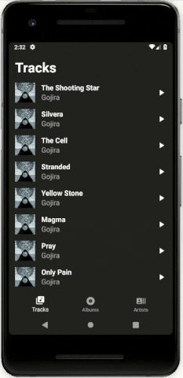

<h1 align="center">Rookie Player</h1>

<strong>Main UI for a potential music application</strong>
 First multi-screen app 💁‍♂️📱✨

 

</img>

<h2>About</h2>
Fifth of eight student projects made in 2017-2018 as part of <a href="https://eu.udacity.com/course/android-basics-nanodegree-by-google--nd803" target="_blank">Udacity's Android Basics Nanodegree</a>.

<h3>☑️ Phase 1 - (Nov. - Feb.):</h3>

1. <a href="https://github.com/r4dixx/LiterallyHelloWorld" target="_blank">Literally Hello World</a>
2. <a href="https://github.com/r4dixx/HelloAndroid" target="_blank">Hello Android</a>
3. <a href="https://github.com/r4dixx/CheesyWinterContest" target="_blank">Cheesy Winter Contest</a>
4. <a href="https://github.com/r4dixx/m32O" target="_blank">m32O</a>

<h3>☑️ Phase 2 - (Feb. - Jul.):</h3>

1. <a href="https://github.com/r4dixx/RookiePlayer" target="_blank"><strong>Rookie Player</strong></a>
2. <a href="https://github.com/r4dixx/VisitCalgary" target="_blank">Visit Calgary</a>
3. <a href="https://github.com/r4dixx/TheGuardianView" target="_blank">The Guardian View</a>
4. <a href="https://github.com/r4dixx/Flourish-And-Blotts-Book-Registry" target="_blank">Flourish & Blotts - Book Registry</a>

<h2>Goal and requirements</h2>

Create a code and UI structure suitable for a music, audiobook or podcast app.

The app should contain 2 to 6 activities clearly defined and labelled. Each activity links to other activities. 

The app should use a custom adapter to populate the layout with views based on instances of the custom class. Information about instances of the custom class are stored in an appropriate data structure (e.g. ArrayList, Array).

Data about each audio file should be stored in a custom class that contains at least 2 states.

<h2>Key learnings</h2>

- ArrayAdapter
- ArrayList
- ListView
- GridView
- Rounded corners
- BottomNavigationView (with activities)

<h2>Installation</h2>

1. Download this project as zip and extract it
2. Import it in Android Studio
3. Sync Gradle and run on your device/emulator

Or use <a href="https://github.com/cesarferreira/dryrun" target="_blank">`dryrun`</a> by <a href="https://github.com/cesarferreira" target="_blank">@CesarFerreira</a>

<h2>Contributing</h2>

No contributions can be made. Project from another time now put in the archive void.

<h2>Project status</h2>
Closed

<h2>Credits</h2>

- Author: <a href="https://twitter.com/r4dixx" target="_blank">Amaël Sikel</a>
- Icon slightly modified from <a href="https://openclipart.org/detail/289382/arrow-button-svg" target="_blank">pdowney's work</a>
- BottomNavigationView made with activities thanks to <a href="https://github.com/ddekanski/BottomNavigationViewBetweenActivities" target="_blank">ddekanski</a>
- Albums featured: 
	- <a href="https://song.link/album/i/1104432592" target="_blank">Magma</a> by <a href="http://www.gojira-music.com/" target="_blank">Gojira</a>, 
	- <a href="https://song.link/album/i/1092026376" target="_blank">99,9%</a> by <a href="http://kaytranada.com/" target="_blank">Kaytranada</a>, 
	- <a href="https://song.link/album/i/1368936707" target="_blank">Death Don't Always Taste Good</a> by <a href="https://soundcloud.com/ivylab" target="_blank">Ivy Lab</a>,
	- <a href="https://song.link/album/i/1340983014" target="_blank">Golden Staples</a> by <a href="https://notscientists.bandcamp.com/" target="_blank">Not Scientists</a>

<h2>Copyright</h2>
This project is licensed under the terms of the MIT license and protected by Udacity Honor Code and Community Code of Conduct. See <a href="LICENSE.md">license</a> and <a href="LICENSE.DISCLAIMER.md">disclaimer</a>.
